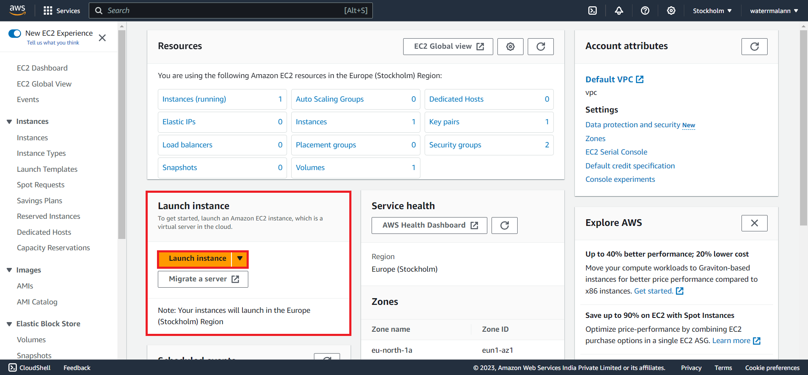

# A simple guide to hosting a Node.js app on AWS EC2.

***Last updated:** November 3rd, 2023*

If you’re a Node.js developer, no matter whether your stack is plain templating (I’m looking at you EJS folks!), MEAN, MERN, MEVN or really anything, this article is meant to be a comprehensive, beginner-friendly guide at hosting your web application on an AWS EC2 instance.

### Prerequisites

1. A public repository on Github/Gitlab so that the project can easily be brought to the server. 

*Otherwise, you will have to bring it manually via something like FTP, which is beyond the scope of this article.* 

1. Register an account on Amazon AWS Console.

*You may have to wait up to 24h for your account to be active and setup.*

1. Register an account on a domain registrar like GoDaddy or Namecheap.

*You will also have to buy a domain name of your choice.*

---

Now that’s out of the way, let’s get started hosting our MERN/MEAN/MEVN-stack application on an Amazon AWS EC2 and that too for free! (If you’re on a new account, for up to an year).

AWS offers a generous free tier where they provide 750 hours/month for an EC2 instance which is more than enough to run a full-stack node project for a year.

## Setting up an AWS EC2 instance.

### Creating the instance.

1. Select “Launch Instance” from the AWS EC2 Console



1. Enter a suitable name for your server.


1. Select `Ubuntu` as your Amazon Machine Image (AMI). I am using `Ubuntu Server 22.04 LTS4.`


1. We need to create a key-pair for remote access. 


1. Enter a name for your key pair and click on `Create key pair` to download the`.pem` (by default) file.


1. We can now click on the `Launch Instance` button from the sidebar. As long as you see the “Free tier” dialog box, you should be good to go as you’ll get the server for free.


Great! Our EC2 instance is setup. We now need to enable inbound connections so that any origin, known or unknown can make a connection to our server.

### Setting up security groups.

1. Security tab from the overview panel, click on the link below “Security groups”


1. Scroll down and select “Inbound rules” tab, then click the “Edit inbound rules” button.


1. We now need to add inbound rules by clicking on the “Add rule” button at the bottom left corner.


1. We should set up the following configurations for HTTP and HTTPs connections in the IPv4 and IPv6 ranges.


The list of inbound rules you should set up are as follows:

1. **HTTP - Anywhere (IPv4):**
    - This rule allows incoming HTTP traffic (port 80) from any IPv4 address. HTTP is used for basic web traffic. You need this rule to ensure that users can access your website through their web browsers.
2. **HTTP - Anywhere (IPv6):**
    - Similar to the first rule, this one allows incoming HTTP traffic, but for IPv6 addresses. It ensures that users with IPv6 connectivity can also access your website. Many modern devices and networks support IPv6 in addition to IPv4.
3. **HTTPS - Anywhere (IPv4):**
    - This rule permits incoming HTTPS traffic (port 443) from any IPv4 address. HTTPS is a secure version of HTTP, commonly used for encrypted data transfer. You need this rule for secure communication with your website, such as for user logins and sensitive data.
4. **HTTPS - Anywhere (IPv6):**
    - Like the previous rule, this one allows incoming HTTPS traffic, but for IPv6 addresses. It ensures that users with IPv6 connectivity can access your website securely.
5. **All traffic - Anywhere (IPv4): [Not Recommended]**
    - This rule allows all types of traffic from any IPv4 address. While it's quite permissive, it can be useful in some cases, such as debugging or if your application requires certain uncommon protocols to function. However, use it with caution because it can pose security risks. Your application should still be able to run fine when this is not specified.
6. **Custom TCP :3000 - Anywhere (IPv4):**
    - This rule allows incoming traffic on a custom port, in this case, port 3000, from any IPv4 address. Change this to whichever port you are running your Node.js application in.

Once everything is set up, our rules should look like so:


1. Save the changes with the button on the bottom right.


Our instance should now be set up, but we have one more step before actually setting up our application.

## Configuring DNS records.

You would need to now configure your DNS records from the Domain provider. For the purposes of this guide, I am using GoDaddy which provides an easy way to take care of this. Although, even if you use another registrar like Namecheap, this step should mostly be similar.

1. Head to the “DNS Records” or management panel of your specific domain. You should see a list of records. We need to edit the one with the type of `A` which has a name of `@`.


1. Update the `Data` field with the public IP address of your EC2 instance.


The changes you made to your DNS configuration are essential for connecting your domain to your server. In simple terms, this configuration does the following:

- It specifies that when someone tries to access your domain (e.g., [www.yourdomain.com](http://www.yourdomain.com/)), the DNS should point to your server's IP address.
- The "A" type record is used to associate a domain with an IP address.
- "Name" @ means the root domain itself (e.g., [yourdomain.com](http://yourdomain.com/)) without any subdomains.
- The TTL is the time the DNS information is cached; 600 seconds means that the information can be cached for 10 minutes.

By setting the "Data" field to your server's IP address, you're telling the DNS to direct traffic to that specific server when someone enters your domain in a web browser. This ensures that visitors to your domain are directed to your AWS EC2 instance, where your application is hosted.

## Connecting to the server.

Now that our server is setup, we need to connect to it remotely using SSH. Remember the key pair that we downloaded earlier? Head over to that directory and open up a command line window there.

1. Go back to our EC2 Console for this step and from the instance details page, click on the `Connect` button.
2. Navigate to the `SSH Client` tab, and copy the SSH command.
3. Paste the command into your terminal, like so


We should now be in! You will be able to interact with the terminal of your Linux machine running on the cloud now.


<details>
<summary> ⚠️ In case you encounter an error regarding “UNPROTECTED PRIVATE KEY FILE” when trying to SSH. </summary>
  
This can happen because your key file has incorrect permissions that prevent SSH from working. This is easily solved by executing: 

*(replace “my-kp.pem” with your key pair file name)*

**Linux (Bash: Running as sudo):**

```bash
chmod 400 "my-kp.pem"
```

**Windows (Powershell: Running as Administrator):**

```powershell
icacls.exe "my-kp.pem" /reset
icacls.exe "my-kp.pem" /grant:r "$($env:username):(r)"
icacls.exe "my-kp.pem" /inheritance:r
```

**Windows (CMD: Running as Administrator):**

```powershell
icacls.exe "my-kp.pem" /reset
icacls.exe "my-kp.pem" /grant "%USERNAME%:R"
icacls.exe "my-kp.pem" /inheritance:r
```
</details>

---

## Installing Node 🔷

**We need to first add the PPA sources for Node.js 18**

```bash
curl -s https://deb.nodesource.com/setup_18.x | sudo bash
```

<aside>
	
> 💡 In Linux, **PPA (Personal Package Archive)** sources are external software repositories, often used in Ubuntu and its derivatives like Linux Mint, which allow users to access additional software packages not found in the official distribution's repositories. These PPAs are typically maintained by individuals or communities, offering users the advantage of obtaining newer software versions or custom packages with ease.

</aside>

**Once added, we can install NodeJS with the following `apt` command.**

```bash
sudo apt install nodejs -y
```

**Let’s confirm whether the installed version is the correct one.**

```bash
node -v # this should show v18.0.0 or above
```

## Installing MongoDB 🍃

Our next major dependency is MongoDB. We have two options here.

1. Use [Mongo Atlas](https://www.mongodb.com/atlas/database) to host the database in servers provided by MongoDB.
2. Run a local instance of MongoDB: Community Edition within our server. *(I recommend this one)*

The following steps are mostly from the [official documentation](https://www.mongodb.com/docs/manual/tutorial/install-mongodb-on-ubuntu/) provided by MongoDB, so do head over there if you’re having any trouble. 

**Import the public GPG key.**

```bash
curl -fsSL https://pgp.mongodb.com/server-7.0.asc | \
   sudo gpg -o /usr/share/keyrings/mongodb-server-7.0.gpg \
   --dearmor
```

**Create a list file for MongoDB.**

```bash
echo "deb [ arch=amd64,arm64 signed-by=/usr/share/keyrings/mongodb-server-7.0.gpg ] https://repo.mongodb.org/apt/ubuntu jammy/mongodb-org/7.0 multiverse" | sudo tee /etc/apt/sources.list.d/mongodb-org-7.0.list
```

Reload local package database, then download and install the latest stable release of MongoDB.

```bash
sudo apt-get update
sudo apt-get install -y mongodb-org
```

Hopefully MongoDB should be installed successfully now, let’s start the system service.

```bash
sudo systemctl start mongod
```

In order to verify that the system service is running, we can always check its status.

```bash
sudo systemctl status mongod
```

Right now, we will have to run the `start mongod` command every time we restart the server. We need to have mongod start on system boot every time. This can be achieved with the enable command.

```bash
sudo systemctl enable mongod
```

Viola! MongoDB should now be up and running. You can access the mongo shell by typing `mongosh`.

## Setting up the project on the server. 📦

**We need to clone our project repository locally.**

```bash
git clone "<repository-url>"
cd "project-title"
```

**We can now install our dependencies.**

Depending on your project, you may have separate folders for frontend and backend and therfore need to run `npm install` on both the folders.

```bash
npm install
```

**We need to setup our environment variables now.**

We can use the `nano` built-in terminal based text editor to create and write to a `.env` file.

```bash
sudo nano .env
```

Copy and paste or write your sensitive environment variables there.

<aside>

> [!NOTE] 
> If you have a `NODE_ENV` in your `.env`. Make sure to set its value to `production`

</aside>

You can save and close the file by pressing `CTRL+X` then `Y` then press `Enter`.

**Our application should be all set to run!**

To test that everything works properly, run the command that starts your application.

```bash
npm start
```

Navigate to the IP address shown in your EC2 console with your port number appended at the end. Eg: **`http://192.168.123.132:3000`** and you should be able to see your project live! If you encounter any problems during this stage, go back and make sure you did the previous steps properly, otherwise it would most definitely be something wrong with your codebase, dependencies, incompatibility with the Linux environment, or inability to load in environment variables.

Great, but we are not done yet. If you have noticed, running `npm start` takes over our whole terminal that we are using to access our EC2 instance, preventing us from doing anything else without stopping the server. 

We want to be able to run the Node.js application as a background process, so that we can interact with our server and change things even when Node.js is running. For this, we can use a tool called **pm2.**

<aside>
	
> 📖 **PM2** (or Process Manager 2) for managing and monitoring Node.js applications in a production environment. You can start, stop, restart, and delete applications with simple commands. One of the most important features of PM2 is its ability to automatically restart your Node.js application if it crashes or encounters an error. This ensures that your application stays online even if there are occasional issues.

</aside>

Setting up PM2 is straightforward. You can install it globally using npm, and then you can easily manage your Node.js applications with simple commands.

```bash
sudo npm i pm2 -g
```

We can now run our node application as a background process using pm2.

```bash
pm2 start **app.js** --name=**"My App Name"**
```

Assuming that the entry file is named `app.js`, this little command should start the server. The `--title` flag is used to provide a neat little, easily identifiable name for our process so that it is easy to manage later on.

> [!IMPORTANT] 
> **In case you’re encountering issues with `.env` file.**
> You can additionally pass in a `--env` flag to set the path for the `.env` file manually. So the modified command would look something like this:
> ```bash
>	pm2 start app.js --name="My App Name" --env=.env
> ``` 
> Where `.env` could be replaced by the path or alternatively you could run the command from the folder that contains the `.env` file and specify a relative path for the `app.js` like `server/app.js`
    

To interact with our Node process, we can use the following pm2 commands:

- `pm2 list`: To show running processes and their IDs.
- `pm2 logs [id]`: To show the console logs generated by the application.
- `pm2 stop [id]`: To stop the process.
- `pm2 restart [id]`: To restart the process.
- `pm2 delete [id]:` To stop and remove a process from the list.

## NGINX & Reverse Proxy 🚦

We now need to setup NGINX to be a reverse proxy, redirecting incoming HTTP requests to our Node.js application.

<aside>
	
> 💡 A **reverse proxy** serves as an intermediary server that receives client requests and forwards them to one or more backend servers, such as Node.js applications, on behalf of the client. It operates by accepting incoming HTTP requests, optionally performing load balancing or caching, and then routing the requests to the appropriate backend server based on predefined rules.

</aside>

We start by installing NGINX.

```bash
cd .. # navigate back to the root dir
sudo apt install nginx
```

We will need to edit a configuration file.

```bash
sudo nano /etc/nginx/sites-available/default
```

You should see a configuration file with a lot of comments. We will need to scroll down to the part where there is a `server_name _;` label.

⭐ **Comment out the existing `location / {` block containing the `try_files` command, replace that with this one.**

```
server_name yourdomain.com www.yourdomain.com;

location / {
	proxy_pass http://localhost:3000;
	proxy_http_version 1.1;
	proxy_set_header Upgrade $http_upgrade;
	proxy_set_header Connection 'upgrade';
	proxy_set_header Host $host;
	proxy_cache_bypass $http_upgrade;
}
```

It should look like so:


Use `CTRL + X`, `Y`, and `Enter` to exit the editor.

- A line-by-line explanation on what we just changed.
    1. `server_name yourdomain.com www.yourdomain.com;`:
        - This line specifies the server names or domain names that this configuration applies to. Replace "[yourdomain.com](http://yourdomain.com/)" with your actual domain name. It means that when requests come in for "[yourdomain.com](http://yourdomain.com/)" or "[www.yourdomain.com](http://www.yourdomain.com/)," this configuration will be used.
    2. `location / {`:
        - This block defines a location where Nginx will apply the following settings. In this case, it's set to the root directory ("/"), so it applies to all requests.
    3. `proxy_pass http://localhost:3000;`:
        - This line is crucial. It tells Nginx to forward incoming HTTP requests to a Node.js application running locally on the same server at port 3000. If your port number is different, you should use a different port. In other words, Nginx acts as a middleman, passing requests to your Node.js app and receiving responses.
    4. `proxy_http_version 1.1;`:
        - This sets the HTTP version for the proxy communication to 1.1. It's a standard configuration for modern web applications.
    5. `proxy_set_header Upgrade $http_upgrade;`:
        - This header is used to upgrade the connection to support WebSocket, which is essential for real-time communication in some applications.
    6. `proxy_set_header Connection 'upgrade';`:
        - This header instructs the proxy to upgrade the connection, again, for WebSocket support.
    7. `proxy_set_header Host $host;`:
        - This header sets the "Host" header to the original domain name. It's important for your Node.js application to know which domain the request was intended for.
    8. `proxy_cache_bypass $http_upgrade;`:
        - This line tells Nginx not to cache requests that contain the "upgrade" header, which is often used for WebSocket connections. Caching WebSocket requests can lead to issues, so this line prevents that.
    
    This NGINX configuration acts as a reverse proxy for your Node.js application. When a request comes in for `yourdomain.com` or `www.yourdomain.com`, NGINX forwards it to your Node.js app running on port 3000. It also ensures that WebSocket connections are properly handled and prevents caching of WebSocket requests.
    

We can now restart NGINX.

```bash
sudo service nginx restart
```

NGINX should now properly act as a reverse proxy, forwarding requests to your Node.js app.

## SSL Certificate 🔒

To secure your app with HTTPS, it's important to obtain an SSL certificate. 

<aside>
	
> 💡 An **SSL certificate**, short for Secure Sockets Layer certificate serves as a digital passport for websites, encrypting data transmitted between a user's web browser and the server. It ensures that sensitive information such as login credentials and financial data remains confidential and protected from potential eavesdropping by malicious parties. SSL certificates establish trust and authenticity, verifying that a website is indeed what it claims to be, safeguarding against phishing attacks. They are a fundamental element in enabling HTTPS, the secure and encrypted browsing experience that has become the standard for online safety, reassuring users that their interactions with a website are secure and private.

</aside>

We'll use [Let's Encrypt](https://letsencrypt.org/) to generate a free SSL certificate for your domain. **We add the PPAs first**.

```bash
sudo add-apt-repository ppa:certbot/certbot
sudo apt-get update
```

**We can now install Certbot, Let's Encrypt's client.**

```bash
sudo apt-get install python3-certbot-nginx
```

**After installation, request a certificate for your domain (replace placeholders).**

```bash
 sudo certbot --nginx -d yourdomain.com -d www.yourdomain.com
```

In a short while, you should see a 🔒 padlock next to your website URL in browser, signifying that the site has HTTPs enabled and is secure.

---

Congratulations! Your Node.js app is now up and running on an AWS EC2 instance, ready to serve users. This setup provides a flexible environment for your web application, allowing you to handle increased traffic and maintain high availability.

~ [***Alan Varghese***](https://alanvarghese.me)
